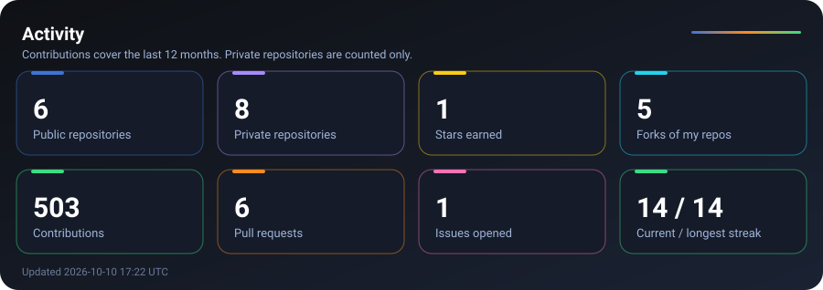
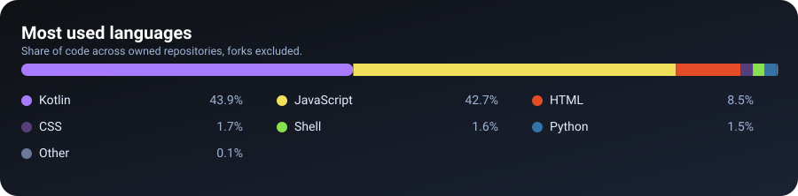

  

  <picture>
    <source media="(prefers-color-scheme: dark)" srcset="https://raw.githubusercontent.com/bhawan-kavinda/bhawan-kavinda/output/github-snake-dark.svg">
    <source media="(prefers-color-scheme: light)" srcset="https://raw.githubusercontent.com/bhawan-kavinda/bhawan-kavinda/output/github-snake.svg">
    
  </picture>

  
  

---

### Overview

Solo developer from Sri Lanka building web and mobile products.

- Exploring new technologies and building cool software.
- Focused on scalable web apps, clean code, and modern design.
- Goal: continuous learning and contributing to open source.

**9** repositories (**3** public, **6** private). Most used: Dart, JavaScript, Kotlin.

---

### Activity

  

---

### Languages and topics

  

`android` `apk` `apk-build` `capacitor` `ci-cd` `github-actions` `mobile-app` `no-code` `nodejs` `pwa` `website-to-app` `webview`

---

### Featured projects

<table>
<tr>
  <td width="50%" valign="top">
    <a href="https://github.com/bhawan-kavinda/Web2APK"><b>Web2APK</b></a> 
    Turn any website or web project into an Android APK using GitHub Actions. No Android Studio, no local setup. Copy one folder and push. 
    JavaScript
  </td>
  <td width="50%"></td>
</tr>
</table>

---

Generated from repository data by GitHub Actions. Last updated 2026-09-29 21:45 UTC.

